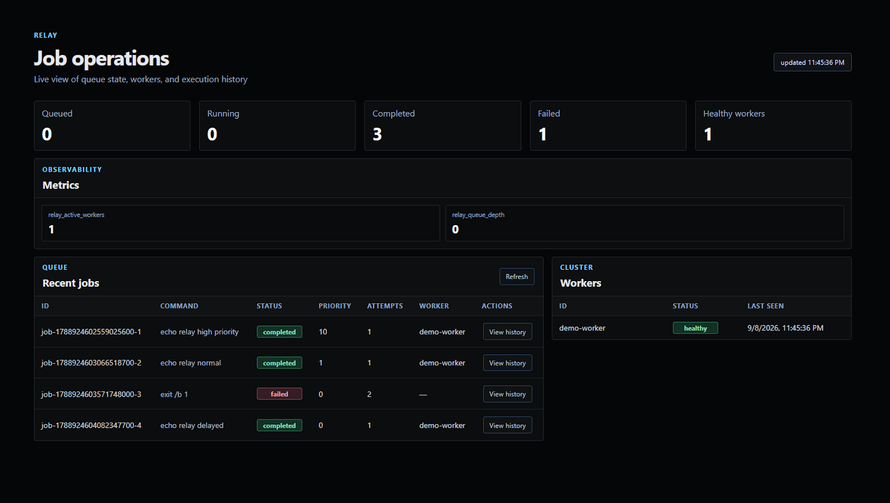

<p align="center">
  
</p>

# Relay

Relay is a distributed job queue and worker system written in Go.

The server accepts command jobs over HTTP, stores them in a priority queue, and assigns them to independent workers. Workers execute the command payload on their host and report the result to the server.

## Current capabilities

- submit jobs through the HTTP API or command line
- prioritize queued jobs
- schedule jobs for a future RFC3339 timestamp
- choose priority or FIFO scheduling
- inspect job status, output, and errors
- inspect job history, queue statistics, and worker statistics
- cancel queued jobs or mark running jobs cancelled
- retry failed jobs with configurable limits and exponential backoff
- enforce execution timeouts
- register multiple workers
- monitor worker heartbeats and recover jobs from failed workers
- distribute jobs across concurrent workers
- execute command payloads using the host operating system's shell
- persist job and worker state to a JSON file
- recover unfinished jobs after a server restart
- expose Prometheus-compatible metrics
- provide structured server events through `log/slog`
- provide an embedded operations dashboard
- include queue, HTTP, persistence, and load benchmarks
- protect shared queue state with synchronization
- verify queue and worker behavior with unit, integration, and race tests

## Architecture

```text
client or CLI
      |
      v
HTTP server
      |
      v
priority queue and state store
      |
      +------------+------------+
      v            v            v
  worker-1     worker-2     worker-3

dashboard and metrics
          |
          v
      HTTP server
```

Jobs move through these states:

```text
queued -> running -> completed
                 \-> failed
running -> queued (retry)
queued or running -> cancelled
```

Higher priority values are claimed first. Jobs with equal priority are claimed in creation order.

## Repository layout

| Path | Purpose |
| --- | --- |
| `cmd/relay/` | Main command line interface for running the server, workers, and client operations |
| `cmd/relay-load/` | HTTP load generator for repeatable submission tests |
| `internal/api/` | Shared HTTP request and response types |
| `internal/client/` | Go client for interacting with a Relay server |
| `internal/dashboard/` | Embedded operations dashboard and static assets |
| `internal/job/` | Job lifecycle models and history events |
| `internal/metrics/` | Prometheus-compatible metrics collection |
| `internal/persistence/` | Atomic JSON state snapshots and recovery |
| `internal/queue/` | Priority/FIFO scheduling, retries, expiration, and worker recovery |
| `internal/server/` | HTTP API, monitoring, persistence, and operational endpoints |
| `internal/worker/` | Worker registration, polling, heartbeats, and command execution |
| `docs/` | Architecture, protocol, persistence, and benchmark guides |

## Quick start

Start the server:

```bash
go run ./cmd/relay server
```

The server persists state to `relay-state.json` by default. Use `--data ""` to run without persistence.

Start one or more workers in separate terminals:

```bash
go run ./cmd/relay worker --id worker-1
go run ./cmd/relay worker --id worker-2
```

Submit a command:

```bash
go run ./cmd/relay submit --max-retries 3 --timeout 30s "echo hello"
```

Inspect jobs and workers:

```bash
go run ./cmd/relay jobs
go run ./cmd/relay job <id>
go run ./cmd/relay workers
```

Cancel a job:

```bash
go run ./cmd/relay cancel <id>
```

Open the dashboard at `http://127.0.0.1:8080/dashboard/`.

The server listens on `127.0.0.1:8080` by default. Use `--server` with client and worker commands when the server uses another address.

### Dashboard

The embedded dashboard provides a compact view of queue health, recent jobs, workers, metrics, command payloads, results, and job history.



## Command line interface

### Start the server

```text
relay server [--listen address] [--data path] [--heartbeat-timeout duration]
             [--monitor-interval duration] [--retry-base-delay duration]
             [--retry-max-delay duration] [--scheduling-policy priority|fifo]
             [--pprof address]
```

### Start a worker

```text
relay worker [--server url] [--id id] [--poll duration]
```

The default worker ID combines the host name and process ID. Set `--id` when running multiple workers on the same host.

### Submit a job

```text
relay submit [--server url] [--type type] [--priority number]
             [--max-retries number] [--timeout duration] [--run-at timestamp] command
```

The command can contain spaces when passed as one quoted argument. The command's combined standard output and standard error are returned as the job result.

`--max-retries` controls how many additional attempts are allowed after the initial attempt. `--timeout` accepts positive Go duration strings such as `30s` or `2m`.

`--run-at` accepts an RFC3339 timestamp. `relay history <id>` prints the lifecycle events recorded for a job.

### Inspect and cancel jobs

```text
relay jobs [--server url]
relay job [--server url] <id>
relay cancel [--server url] <id>
relay workers [--server url]
relay stats [--server url]
relay history [--server url] <id>
```

`relay stats` prints queue counts, worker health, and current metric values as JSON.

## HTTP API

| Method | Endpoint | Purpose |
| --- | --- | --- |
| `GET` | `/healthz` | Check server availability |
| `POST` | `/v1/jobs` | Create a job |
| `GET` | `/v1/jobs` | List jobs |
| `GET` | `/v1/jobs/{id}` | Return one job |
| `GET` | `/v1/jobs/{id}/history` | Return lifecycle events |
| `POST` | `/v1/jobs/{id}/cancel` | Cancel a job |
| `POST` | `/v1/workers/register` | Register a worker |
| `POST` | `/v1/workers/{id}/heartbeat` | Record worker health |
| `GET` | `/v1/workers` | List workers |
| `POST` | `/v1/workers/{id}/claim` | Claim the next queued job |
| `POST` | `/v1/jobs/{id}/result` | Report a worker result |
| `GET` | `/v1/stats` | Return queue and worker statistics |
| `GET` | `/metrics` | Return Prometheus-compatible metrics |
| `GET` | `/dashboard/` | Serve the embedded dashboard |

Create a job:

```json
{
  "type": "command",
  "payload": "echo hello",
  "priority": 1,
  "max_retries": 3,
  "timeout": "30s",
  "run_at": "2026-09-09T12:00:00Z"
}
```

Report a successful result:

```json
{
  "worker_id": "worker-1",
  "success": true,
  "result": "hello"
}
```

## Operational boundaries

- state is persisted to a local JSON file by default; the file is replaced after successful state snapshots
- jobs that were running during a server restart are returned to the queue and may execute again
- failures between execution and acknowledgement can result in duplicate execution
- workers execute submitted commands with the permissions of their local process
- cancelling a running job changes its recorded state but does not interrupt the command already running on the worker
- workers send periodic heartbeats while they are running
- retry and timeout settings are applied by the server and worker together
- the dashboard and metrics endpoints do not provide authentication
- `--pprof` should only bind to a trusted interface

Only submit commands that are trusted to run on the worker host.

## Development

Format the source:

```bash
gofmt -w cmd internal
```

Run tests:

```bash
go test ./...
```

Run the race detector:

```bash
go test -race ./...
```

Run static checks:

```bash
go vet ./...
```

Run Go benchmarks:

```bash
go test -bench '^Benchmark' -benchmem ./internal/queue ./internal/server ./internal/persistence
```

Run the submission load generator against a running server:

```bash
go run ./cmd/relay-load -clients 10 -requests 1000
```

Read the detailed guides:

- [architecture](docs/architecture.md)
- [protocol](docs/protocol.md)
- [persistence](docs/persistence.md)
- [benchmarks](docs/benchmarks.md)

The repository uses the MIT License.
