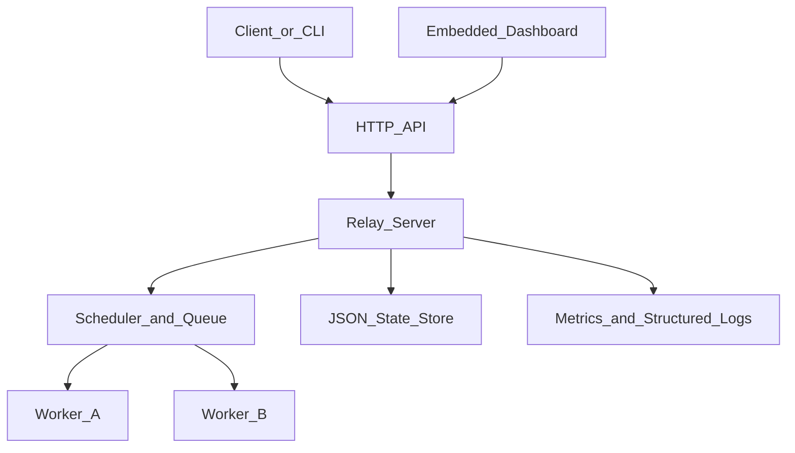

# Relay architecture

Relay separates job submission, scheduling, execution, and state storage.

## Server

The server owns job state and is the only component allowed to transition a job between lifecycle states. It exposes the HTTP API, records worker liveness, persists snapshots, and runs the timeout and failure monitor.

The server can use either of two scheduling policies:

- `priority` selects the highest-priority ready job and uses creation time as the tie breaker
- `fifo` selects the oldest ready job regardless of priority

Jobs with a future `run_at` timestamp remain queued until their scheduled time.

## Queue

The queue protects its job map and ready heap with a mutex. Claims remove a job from the ready heap and mark it running in one critical section, so concurrent workers cannot claim the same attempt.

Failed attempts use exponential backoff bounded by the server retry settings. A job is requeued while its attempt count is within `max_retries`; otherwise it becomes failed.

Timeouts and worker loss use the same failure transition as an explicit worker failure. This keeps retry behavior consistent across failure sources.

## Workers

Workers register with the server, send periodic heartbeats, poll for jobs, execute command payloads through the host shell, and report results. A worker keeps heartbeats in a separate loop while a command is running.

The execution model is at least once. If the worker completes a command but the result acknowledgement is lost, the server may recover and assign the job again.

## Persistence

The default server state file is `relay-state.json`. Each mutation writes a complete JSON snapshot through a temporary file before replacing the active file. On startup, running jobs are returned to the queue and persisted workers are marked dead until they register again.

The state file contains jobs, lifecycle history, retry metadata, scheduling metadata, and worker registration state.

## Observability

The server records structured events with `log/slog` and exposes:

- `/metrics` for Prometheus-compatible counters, gauges, and histograms
- `/v1/stats` for queue and worker summaries
- `/v1/jobs/{id}/history` for one job's lifecycle events
- `/healthz` for a basic availability check

## Dashboard

The dashboard is embedded into the Relay binary. It polls the API, displays queue and worker summaries, lists recent jobs, shows job history, and provides cancellation controls.

Open it at `/dashboard/` on the server address.

## Package responsibilities

- `cmd/relay`: command line entry point
- `cmd/relay-load`: concurrent HTTP submission load generator
- `internal/api`: shared request and response types
- `internal/client`: HTTP client used by commands and workers
- `internal/dashboard`: embedded dashboard assets
- `internal/job`: job and lifecycle event models
- `internal/metrics`: concurrency-safe metrics collection
- `internal/persistence`: atomic JSON snapshot storage
- `internal/queue`: scheduling, transitions, retries, and recovery
- `internal/server`: HTTP API, worker liveness, persistence, and observability integration
- `internal/worker`: registration, heartbeats, command execution, and result reporting
